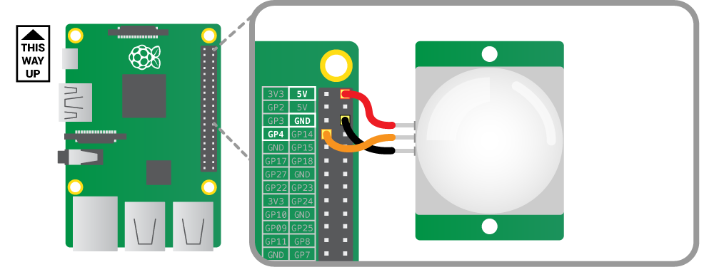

# Motion Detector With RaspberryPi and Telegram Bot 

How to use a Raspberry Pi to find out who’s been in your home! Make a motion detector that uses a motion sensor to trigger video recording via the Raspberry Pi Camera Module. The video is send on your smartphone by Telegram Bot 


### Prerequisites

* Raspberry Pi Camera Module  
* PIR motion sensor module   
* 3 female-to-female jumper wires   
* [Create a Telegram Bot](https://core.telegram.org/bots#3-how-do-i-create-a-bot)  

### Connect the PIR sensor



## Quick start

 * Add the Python dependencies see Installing section   
 * Add your token_id in `lib/config.pl`   
 ```
     bot_id      = 'Your_token_id'
```
 * Launch script `motion-detector.py`  
 

### Installing

Installing python3 dependencies  :   
```
pip3 install -r requirement.txt
```
Launch `setup.py` which sudo command for create systemd service and start service 
```
sudo ./setup.py
```

### Details 

* By default, the duration of the video is set to 20s. If you want change this, you need to modify the video_time variable in `lib/config.py`    
```
video_time = 20
```
* `setup.py` action :   
   * Build systemd service motion-detector.service with current directory   
   * Create link in  `/etc/systemd/system`    
   * Activate service at boot    
   * Start service 
   
### Bot commands

* /start launch the dectection  
* /stop stop the detection  
* /snap take a photo  
* /status show status of the movement detection  
* /help show help  
* /clean remove all files in video folder  
  
## Built With

* [gpiozero](https://pypi.org/project/gpiozero/)
* [telepot](https://pypi.org/project/telepot/)  
* [picamera](https://pypi.org/project/picamera/) 


